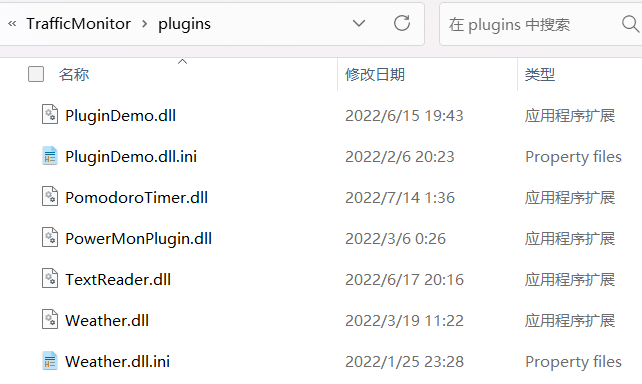
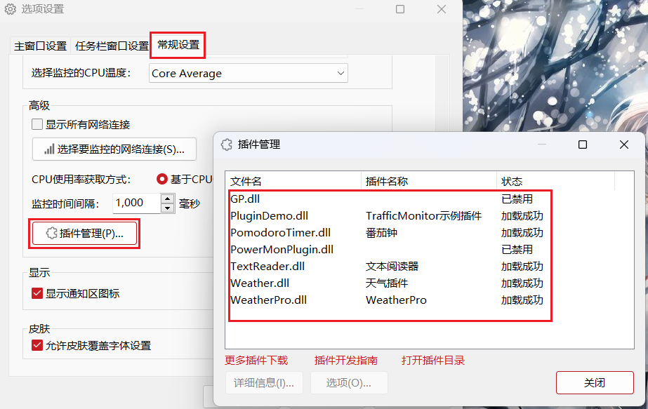
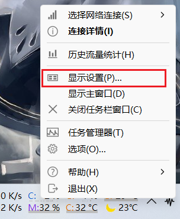
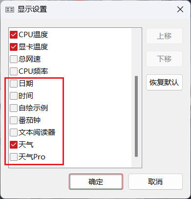

# TrafficMonitorPlugins
这是用于[TrafficMonitor](https://github.com/zhongyang219/TrafficMonitor)的插件。

## 插件下载

请点击以下链接转到插件下载页面：

[TrafficMonitor 插件下载](./download/plugin_download.md)

## 插件使用说明

根据TrafficMonitor的版本（x86为32位，x64为64位）选择对应版本的插件，下载后解压可得到dll文件，下载后将插件dll放到TrafficMonitor程序所在目录下的`plugins`目录下：

重新启动TrafficMonitor后可以在“选项”——“常规设置”——“插件管理”中看到所有的插件：

要使插件项目显示到任务栏中，请在任务栏窗口上点击鼠标右键，选择“显示设置”。

此时，“显示设置”中会显示已加载的插件项目，勾选你希望显示在任务栏上的项目，点击确定即可。

关于更多插件使用的详细说明，请参考以下链接：

[插件功能 · zhongyang219/TrafficMonitor Wiki (github.com)](https://github.com/zhongyang219/TrafficMonitor/wiki/插件功能)

## 如何开发插件

关于如何开发TrafficMonitor，请参考以下链接：

[插件开发指南 · zhongyang219/TrafficMonitor Wiki (github.com)](https://github.com/zhongyang219/TrafficMonitor/wiki/插件开发指南)

