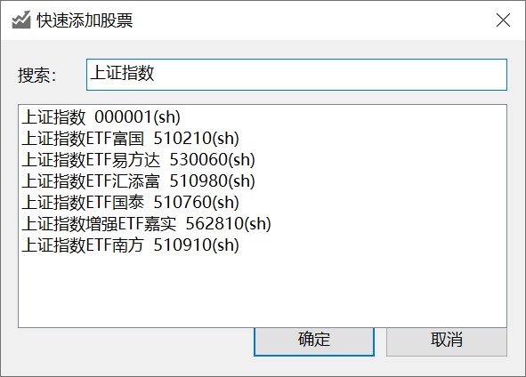
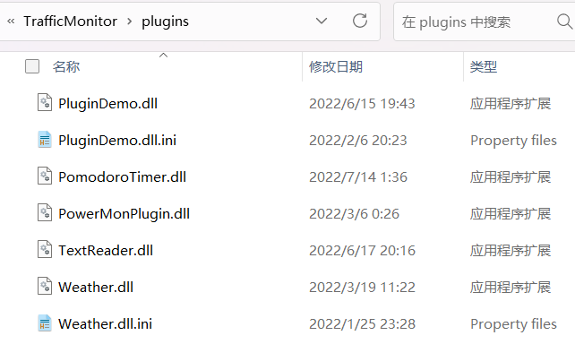
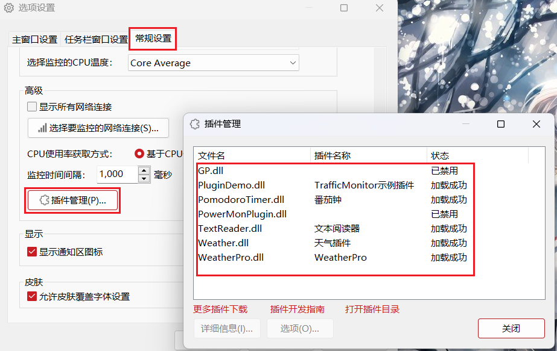
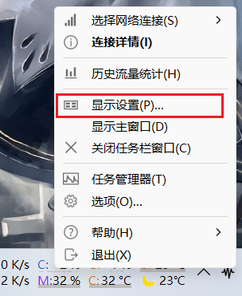
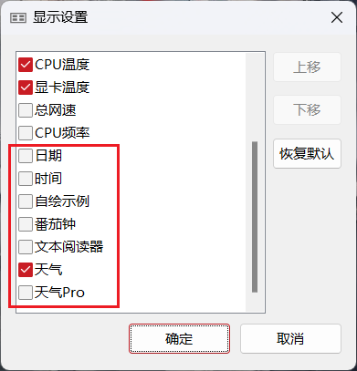

# TrafficMonitorPlugins
这是用于[TrafficMonitor](https://github.com/zhongyang219/TrafficMonitor)的插件。

## StockPlus 股票增强插件

股票插件的增强版，相比原股票插件增加了以下功能：
- 支持香港交易所（`rt_hk`）和美股（`gb_`）股票
- 显示买卖五档盘口数据
- 分时走势图展示
- 浮动窗口显示详细行情信息
- 便捷的股票管理功能

## 插件下载

请点击以下链接转到插件下载页面：

[TrafficMonitor 插件下载](./download/plugin_download.md)

## 插件使用说明

根据TrafficMonitor的版本（x86为32位，x64为64位）选择对应版本的插件，下载后解压可得到dll文件，下载后将插件dll放到TrafficMonitor程序所在目录下的`plugins`目录下：

重新启动TrafficMonitor后可以在“选项”——“常规设置”——“插件管理”中看到所有的插件：

要使插件项目显示到任务栏中，请在任务栏窗口上点击鼠标右键，选择“显示设置”。

此时，“显示设置”中会显示已加载的插件项目，勾选你希望显示在任务栏上的项目，点击确定即可。

关于更多插件使用的详细说明，请参考以下链接：

[插件功能 · zhongyang219/TrafficMonitor Wiki (github.com)](https://github.com/zhongyang219/TrafficMonitor/wiki/插件功能)

## 如何开发插件

关于如何开发TrafficMonitor，请参考以下链接：

[插件开发指南 · zhongyang219/TrafficMonitor Wiki (github.com)](https://github.com/zhongyang219/TrafficMonitor/wiki/插件开发指南)

## 插件的提交

你可以向我发送电子邮件来提交你开发的插件，并附上插件简介和下载地址。也可以直接向此仓库提交pull request来更新插件下载页面：[plugin_download.md](download/plugin_download.md) 和 [plugin_download_en.md](download/plugin_download_en.md)，按照文档原来的格式添加插件介绍和下载链接。同时更新一下[plugins_version.xml](plugins_version.xml)文件，这个文件用于在TrafficMonitor的“插件管理”界面显示插件是否有更新，在`plugins_version.xml`中添加你插件的文件名和最新的版本号，当插件有更新时也要更新一下这个文件里的版本号。
