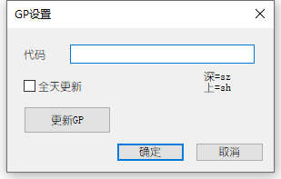

# TrafficMonitor插件下载

欢迎大家为TrafficMonitor开发自己的插件，如果你想提交你制作的插件，请将插件编译成dll文件后通过电子邮件发送到 zhongyang219@hotmail.com，邮件请注明“TrafficMonitor插件”，请尽可能提供32位和64位的版本。

## 如何开发插件

关于如何开发TrafficMonitor的插件，请参阅[插件开发指南](https://github.com/zhongyang219/TrafficMonitor/wiki/%E6%8F%92%E4%BB%B6%E5%BC%80%E5%8F%91%E6%8C%87%E5%8D%97)。

## 插件使用说明

请根据你使用的TrafficMonitor版本下载对应版本的插件（32位或64位），下载后将dll放到TrafficMonitor.exe所在目录的plugins目录下（如果没有请创建），然后重新启动TrafficMonitor，插件将会被自动加载。

## 插件下载

### 示例插件

用于显示日期和时间的插件。

下载链接：[32位下载](https://github.com/zhongyang219/TrafficMonitorPlugins/blob/main/download/PluginDemo/PluginDemo_V1.00_x86.zip?raw=true) [64位下载](https://github.com/zhongyang219/TrafficMonitorPlugins/blob/main/download/PluginDemo/PluginDemo_V1.00_x64.zip?raw=true)

---

### 天气插件

用于显示天气的插件，支持手动选择城市（仅支持中国的城市），支持显示今天和明天的天气。

下载链接：[32位下载](https://github.com/zhongyang219/TrafficMonitorPlugins/blob/main/download/weather/Weather_V1.01_x86.zip?raw=true) [64位下载](https://github.com/zhongyang219/TrafficMonitorPlugins/blob/main/download/weather/Weather_V1.01_x64.zip?raw=true)

---

### 电池电量插件

用于显示电脑电池的电量的插件。

下载链接：[32位下载](https://github.com/zhongyang219/TrafficMonitorPlugins/blob/main/download/Battery/Battery_V1.00_x86.zip?raw=true) [64位下载](https://github.com/zhongyang219/TrafficMonitorPlugins/blob/main/download/Battery/Battery_V1.00_x64.zip?raw=true)

---

### GP插件

显示指定GP的实时交易信息 `新浪接口`

- **配置时sh表示“上证”，sz表示深证，依次类推**

下载链接：[32位下载](https://github.com/zhongyang219/TrafficMonitorPlugins/blob/main/download/GP/GP_V1.02_x86.zip?raw=true) [64位下载](https://github.com/zhongyang219/TrafficMonitorPlugins/blob/main/download/GP/GP_V1.02_x64.zip?raw=true)

---
