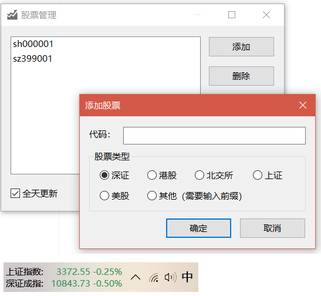
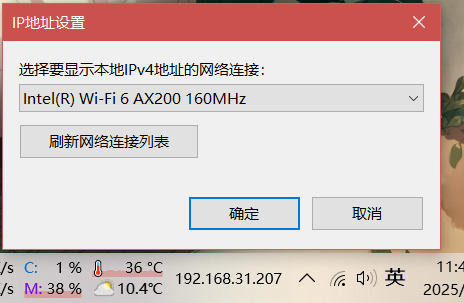

**简体中文 | [English](plugin_download_en.md)**

# TrafficMonitor插件下载

欢迎大家为TrafficMonitor开发自己的插件，如果你想提交你制作的插件，请发送电子邮件到 zhongyang219@hotmail.com，并附上下载链接，邮件请注明“TrafficMonitor插件”。

## 如何开发插件

关于如何开发TrafficMonitor的插件，请参阅[插件开发指南](https://github.com/zhongyang219/TrafficMonitor/wiki/%E6%8F%92%E4%BB%B6%E5%BC%80%E5%8F%91%E6%8C%87%E5%8D%97)。

## 插件使用说明

请根据你使用的TrafficMonitor版本下载对应版本的插件（32位或64位），下载后将dll放到TrafficMonitor.exe所在目录的plugins目录下（如果没有请创建），然后重新启动TrafficMonitor，插件将会被自动加载。

关于插件使用的详细说明，请参考以下链接：

[插件功能 · zhongyang219/TrafficMonitor Wiki (github.com)](https://github.com/zhongyang219/TrafficMonitor/wiki/插件功能)

## 插件下载

### 时间日期插件

用于显示日期和时间的插件。

* 版本：V1.00

* 下载链接：

  GitHub: [Release DateTime_V1.00 · zhongyang219/TrafficMonitorPlugins](https://github.com/zhongyang219/TrafficMonitorPlugins/releases/tag/DateTime_V1.00)

  Gitee: [DateTime_V1.00 · zhongyang219/TrafficMonitorPlugins - Gitee.com](https://gitee.com/zhongyang219/TrafficMonitorPlugins/releases/tag/DateTime_V1.00)

---

### 天气插件

用于显示天气的插件，支持手动选择城市（仅支持中国的城市），支持显示今天和明天的天气。

* 版本：V1.03

* 下载链接：

  GitHub: [Release Weather_V1.03 · zhongyang219/TrafficMonitorPlugins](https://github.com/zhongyang219/TrafficMonitorPlugins/releases/tag/Weather_V1.03)

  Gitee: [Weather_V1.03 · zhongyang219/TrafficMonitorPlugins - Gitee.com](https://gitee.com/zhongyang219/TrafficMonitorPlugins/releases/tag/Weather_V1.03)

---

### WeatherPro

用于显示天气的插件。支持网页抓取与和风天气API两种数据源。

* 作者：[Haojia521](https://github.com/Haojia521)

* 主页：[Haojia521/TrafficMonitorPlugins (github.com)](https://github.com/Haojia521/TrafficMonitorPlugins)

* 下载链接：[WeatherPro-releases](https://github.com/Haojia521/TrafficMonitorPlugins/releases)

---

### 电池电量插件

用于显示电脑电池的电量的插件。

* 版本：V1.03

* 下载链接：

  GitHub: [Release Battery_V1.03 · zhongyang219/TrafficMonitorPlugins](https://github.com/zhongyang219/TrafficMonitorPlugins/releases/tag/Battery_V1.03)
  
  Gitee: [Battery_V1.03 · zhongyang219/TrafficMonitorPlugins - Gitee.com](https://gitee.com/zhongyang219/TrafficMonitorPlugins/releases/tag/Battery_V1.03)

---

### 股票插件

显示指定股票的实时交易信息 `新浪接口`

- **配置时sh表示“上证”，sz表示深证，依次类推**

* 作者：[CListery](https://github.com/CListery)

* 下载链接：

  GitHub: [Release Stock_V1.13 · zhongyang219/TrafficMonitorPlugins](https://github.com/zhongyang219/TrafficMonitorPlugins/releases/tag/Stock_V1.13)
  
  Gitee: [Stock_V1.13 · zhongyang219/TrafficMonitorPlugins - Gitee.com](https://gitee.com/zhongyang219/TrafficMonitorPlugins/releases/tag/Stock_V1.13)

---

### 电池功耗检测插件

用于显示电池的功耗。同时可以在鼠标提示中显示剩余电量、电池电压信息。

* 作者：[AzulEterno](https://github.com/AzulEterno)

* 主页：[AzulEterno/Plugins-For-TrafficMonitor (github.com)](https://github.com/AzulEterno/Plugins-For-TrafficMonitor)

* 下载链接：[Releases · AzulEterno/PowerMonPlugin-For-TrafficMonitor](https://github.com/AzulEterno/PowerMonPlugin-For-TrafficMonitor/releases)

---

### 番茄钟插件

提供基本的番茄时间管理功能。红色图标代表工作时段，绿色代表休息时段。

* 作者：[Haojia521](https://github.com/Haojia521)

* 下载链接：[PomodoroTimer-releases](https://github.com/Haojia521/TrafficMonitorPlugins/releases)

---

### 文本阅读器插件

文本阅读器插件可用于在任务栏阅读文本文件。具有章节识别、书签、自动翻页等功能。

使用鼠标点击或下方向键可以向后翻页，上方向键向前翻页，左右方向键可以一次移动一个字符。

* 版本：V1.02

* 下载链接：

  GitHub: [Release TextReader_V1.02 · zhongyang219/TrafficMonitorPlugins](https://github.com/zhongyang219/TrafficMonitorPlugins/releases/tag/TextReader_V1.02)

  Gitee: [TextReader_V1.02 · zhongyang219/TrafficMonitorPlugins - Gitee.com](https://gitee.com/zhongyang219/TrafficMonitorPlugins/releases/tag/TextReader_V1.02)

---

### 硬件监控插件

说明：

- 硬件监控插件使用了第三库LibreHardwareMonitor。可以在标准版和Lite版TrafficMonitor中使用，但是由于Lite版没有管理员权限，因此可能无法显示所有的硬件信息。
- 解压后，将`HardwareMonitor.dll`放到`plugins`目录下，将`zh-CN`文件夹和`LibreHardwareMonitorLib.dll`放到TrafficMonitor所在目录下（注意不是`plugins`目录下）。由于标准版TrafficMonitor自带`LibreHardwareMonitorLib.dll`，因此可以忽略此文件。
- 启动TrafficMonitor，打开“插件管理”对话框，选中“硬件监控插件”，点击“选项”，点击“添加监控项”，按钮，在“硬件信息”对话框中选择要添加的监控项，点击鼠标右键，选择“添加到监控项目”，关闭对话框。
- 关闭所有对话框，重新启动TrafficMonitor，在任务栏窗口点击右键菜单，选择“显示设置”，即可看到添加的硬件监控项目。

* 版本：V1.00

* 下载链接：

  GitHub: [Release HardwareMonitor_V1.00 · zhongyang219/TrafficMonitorPlugins](https://github.com/zhongyang219/TrafficMonitorPlugins/releases/tag/HardwareMonitor_V1.00)
  
  Gitee: [HardwareMonitor_V1.00 · zhongyang219/TrafficMonitorPlugins - Gitee.com](https://gitee.com/zhongyang219/TrafficMonitorPlugins/releases/tag/HardwareMonitor_V1.00)

---

### IP地址插件

用于显示本地IP地址的插件。

* 版本：V1.00

* 下载链接：

  GitHub: [Release IpAddress_V1.00 · zhongyang219/TrafficMonitorPlugins](https://github.com/zhongyang219/TrafficMonitorPlugins/releases/tag/IpAddress_V1.00)
  
  Gitee: [IpAddress_V1.00 · zhongyang219/TrafficMonitorPlugins - Gitee.com](https://gitee.com/zhongyang219/TrafficMonitorPlugins/releases/tag/IpAddress_V1.00)

---

### Lua Plugin

一个支持使用Lua脚本编写插件的TrafficMonitor插件。

* 作者：[compilelife](https://github.com/compilelife)

* 主页：[compilelife/TrafficMonitorLuaPlugin: Missing Plugin for TrafficMonitor to support lua](https://github.com/compilelife/TrafficMonitorLuaPlugin)

* 下载链接：[Releases · compilelife/TrafficMonitorLuaPlugin](https://github.com/compilelife/TrafficMonitorLuaPlugin/releases)

