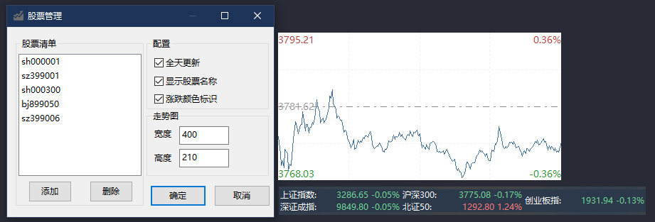

**简体中文 | [English](plugin_download_en.md)**

# TrafficMonitor插件下载

欢迎大家为TrafficMonitor开发自己的插件，如果你想提交你制作的插件，请发送电子邮件到 zhongyang219@hotmail.com，并附上下载链接，邮件请注明“TrafficMonitor插件”。

## 如何开发插件

关于如何开发TrafficMonitor的插件，请参阅[插件开发指南](https://github.com/zhongyang219/TrafficMonitor/wiki/%E6%8F%92%E4%BB%B6%E5%BC%80%E5%8F%91%E6%8C%87%E5%8D%97)。

## 插件使用说明

请根据你使用的TrafficMonitor版本下载对应版本的插件（32位或64位），下载后将dll放到TrafficMonitor.exe所在目录的plugins目录下（如果没有请创建），然后重新启动TrafficMonitor，插件将会被自动加载。

关于插件使用的详细说明，请参考以下链接：

[插件功能 · zhongyang219/TrafficMonitor Wiki (github.com)](https://github.com/zhongyang219/TrafficMonitor/wiki/插件功能)

## 插件下载

### 时间日期插件

用于显示日期和时间的插件。

* 版本：V1.00

* 下载链接：

  GitHub: [Release DateTime_V1.00 · zhongyang219/TrafficMonitorPlugins](https://github.com/zhongyang219/TrafficMonitorPlugins/releases/tag/DateTime_V1.00)

  Gitee: [DateTime_V1.00 · zhongyang219/TrafficMonitorPlugins - Gitee.com](https://gitee.com/zhongyang219/TrafficMonitorPlugins/releases/tag/DateTime_V1.00)

---

### 天气插件

用于显示天气的插件，支持手动选择城市（仅支持中国的城市），支持显示今天和明天的天气。

* 版本：V1.03

* 下载链接：

  GitHub: [Release Weather_V1.03 · zhongyang219/TrafficMonitorPlugins](https://github.com/zhongyang219/TrafficMonitorPlugins/releases/tag/Weather_V1.03)

  Gitee: [Weather_V1.03 · zhongyang219/TrafficMonitorPlugins - Gitee.com](https://gitee.com/zhongyang219/TrafficMonitorPlugins/releases/tag/Weather_V1.03)

---

### WeatherPro

用于显示天气的插件。支持多种数据源和丰富的配置选项。

* 作者：[Haojia521](https://github.com/Haojia521)

* 下载链接：
  
  Github: https://github.com/Haojia521/TMP-WeatherPro/releases
  
  Gitee: https://gitee.com/Haojia521/TMP-WeatherPro/releases

---

### 电池电量插件

用于显示电脑电池的电量的插件。

* 版本：V1.03

* 下载链接：

  GitHub: [Release Battery_V1.03 · zhongyang219/TrafficMonitorPlugins](https://github.com/zhongyang219/TrafficMonitorPlugins/releases/tag/Battery_V1.03)
  
  Gitee: [Battery_V1.03 · zhongyang219/TrafficMonitorPlugins - Gitee.com](https://gitee.com/zhongyang219/TrafficMonitorPlugins/releases/tag/Battery_V1.03)

---

### 股票插件

显示指定股票的实时交易信息 `新浪接口`

> **配置时sh表示“上证”，sz表示深证，依次类推**

* 作者：[CListery](https://github.com/CListery)

* 仓库地址（插件 issue 可以提到这里）：[CListery · TrafficMonitorPlugins](https://github.com/CListery/TrafficMonitorPlugins)

* 下载链接：

  > 由于主干代码更新可能不及时，请从下面这些地方检查最新版本

  * 主干

    * GitHub: [Release Stock_V1.13 · zhongyang219/TrafficMonitorPlugins](https://github.com/zhongyang219/TrafficMonitorPlugins/releases/tag/Stock_V1.13)

    * Gitee: [Stock_V1.13 · zhongyang219/TrafficMonitorPlugins - Gitee.com](https://gitee.com/zhongyang219/TrafficMonitorPlugins/releases/tag/Stock_V1.13)

  * 分支

    * GitHub: [Release · CListery/TrafficMonitorPlugins](https://github.com/CListery/TrafficMonitorPlugins/releases)

---

### 电池功耗检测插件

用于显示电池的功耗。同时可以在鼠标提示中显示剩余电量、电池电压信息。

* 作者：[AzulEterno](https://github.com/AzulEterno)

* 主页：[AzulEterno/Plugins-For-TrafficMonitor (github.com)](https://github.com/AzulEterno/Plugins-For-TrafficMonitor)

* 下载链接：[Releases · AzulEterno/PowerMonPlugin-For-TrafficMonitor](https://github.com/AzulEterno/PowerMonPlugin-For-TrafficMonitor/releases)

---

### 番茄钟插件

提供基本的番茄时间管理功能。红色图标代表工作时段，绿色代表休息时段。

* 作者：[Haojia521](https://github.com/Haojia521)

* 下载链接：[PomodoroTimer-releases](https://github.com/Haojia521/TrafficMonitorPlugins/releases)

---

### 文本阅读器插件

文本阅读器插件可用于在任务栏阅读文本文件。具有章节识别、书签、自动翻页等功能。

使用鼠标点击或下方向键可以向后翻页，上方向键向前翻页，左右方向键可以一次移动一个字符。

* 版本：V1.02

* 下载链接：

  GitHub: [Release TextReader_V1.02 · zhongyang219/TrafficMonitorPlugins](https://github.com/zhongyang219/TrafficMonitorPlugins/releases/tag/TextReader_V1.02)

  Gitee: [TextReader_V1.02 · zhongyang219/TrafficMonitorPlugins - Gitee.com](https://gitee.com/zhongyang219/TrafficMonitorPlugins/releases/tag/TextReader_V1.02)

---

### 硬件监控插件

说明：

- 硬件监控插件使用了第三库LibreHardwareMonitor。可以在标准版和Lite版TrafficMonitor中使用，但是由于Lite版没有管理员权限，因此可能无法显示所有的硬件信息。
- 解压后，将`HardwareMonitor.dll`放到`plugins`目录下，将`zh-CN`文件夹和`LibreHardwareMonitorLib.dll`放到TrafficMonitor所在目录下（注意不是`plugins`目录下）。由于标准版TrafficMonitor自带`LibreHardwareMonitorLib.dll`，因此可以忽略此文件。
- 启动TrafficMonitor，打开“插件管理”对话框，选中“硬件监控插件”，点击“选项”，点击“添加监控项”，按钮，在“硬件信息”对话框中选择要添加的监控项，点击鼠标右键，选择“添加到监控项目”，关闭对话框。
- 关闭所有对话框，重新启动TrafficMonitor，在任务栏窗口点击右键菜单，选择“显示设置”，即可看到添加的硬件监控项目。

* 版本：V1.00

* 下载链接：

  GitHub: [Release HardwareMonitor_V1.00 · zhongyang219/TrafficMonitorPlugins](https://github.com/zhongyang219/TrafficMonitorPlugins/releases/tag/HardwareMonitor_V1.00)
  
  Gitee: [HardwareMonitor_V1.00 · zhongyang219/TrafficMonitorPlugins - Gitee.com](https://gitee.com/zhongyang219/TrafficMonitorPlugins/releases/tag/HardwareMonitor_V1.00)

---

### IP地址插件

用于显示本地IP地址的插件。

* 版本：V1.00

* 下载链接：

  GitHub: [Release IpAddress_V1.00 · zhongyang219/TrafficMonitorPlugins](https://github.com/zhongyang219/TrafficMonitorPlugins/releases/tag/IpAddress_V1.00)
  
  Gitee: [IpAddress_V1.00 · zhongyang219/TrafficMonitorPlugins - Gitee.com](https://gitee.com/zhongyang219/TrafficMonitorPlugins/releases/tag/IpAddress_V1.00)

---

### Lua Plugin

一个支持使用Lua脚本编写插件的TrafficMonitor插件。

* 作者：[compilelife](https://github.com/compilelife)

* 主页：[compilelife/TrafficMonitorLuaPlugin: Missing Plugin for TrafficMonitor to support lua](https://github.com/compilelife/TrafficMonitorLuaPlugin)

* 下载链接：[Releases · compilelife/TrafficMonitorLuaPlugin](https://github.com/compilelife/TrafficMonitorLuaPlugin/releases)

---

### 键盘指示器

一个用于显示键盘Caps Lock、Num Lock、Scroll Lock等状态的插件。

* 版本：V1.00

* 下载链接：

  GitHub: [Release KeyboardIndicator_V1.00 · zhongyang219/TrafficMonitorPlugins](https://github.com/zhongyang219/TrafficMonitorPlugins/releases/tag/KeyboardIndicator_V1.00)

  Gitee: [KeyboardIndicator_V1.00 · zhongyang219/TrafficMonitorPlugins - Gitee.com](https://gitee.com/zhongyang219/TrafficMonitorPlugins/releases/tag/KeyboardIndicator_V1.00)

---

### 响度计

一个用于显示当前系统音量的插件。

* 版本：V1.00

* 下载链接：

  GitHub: [Release LoudnessMeter_V1.00 · zhongyang219/TrafficMonitorPlugins](https://github.com/zhongyang219/TrafficMonitorPlugins/releases/tag/LoudnessMeter_V1.00)

  Gitee: [LoudnessMeter_V1.00 · zhongyang219/TrafficMonitorPlugins - Gitee.com](https://gitee.com/zhongyang219/TrafficMonitorPlugins/releases/tag/LoudnessMeter_V1.00)

### 米家插座功率插件

这是一个 TrafficMonitor 插件，可以在 Windows 任务栏实时显示米家/酷控（cuco）智能插座的功率数值，并可选开启功率历史记录功能。

* 作者：[cxhoyo](https://github.com/cxhoyo)
* 主页：[cxhoyo/MijiaPluginForTM: 米家智能插座功率显示插件_TrafficMonitor](https://github.com/cxhoyo/MijiaPluginForTM/tree/main?tab=readme-ov-file)
* 下载链接：[Releases · cxhoyo/MijiaPluginForTM](https://github.com/cxhoyo/MijiaPluginForTM/releases)

### IP 定位插件

给 TrafficMonitor 做了款全新 IP 定位插件，精准显示公网出口 IP + 地区信息，每 30 秒自动刷新，直接解决原版插件 IP 显示不准、无地区展示的核心问题，轻量适配 Win10/11，和 TrafficMonitor v1.85.1 完美兼容！
这些场景用超方便：✅ VPN / 代理用户：切换节点后秒验出口 IP + 地区，确认节点是否生效✅ 远程办公 / 开发：快速查公网 IP，方便服务器连接、端口映射配置✅ 网络排障：一键确认真实出口 IP，快速定位网络访问 / 路由问题✅ 多节点测试：来回切换代理 / VPN 节点，无需额外工具，实时看 IP 状态

* 作者：[byLennert](https://github.com/byLennert)
* 主页：[byLennert/IPLocation_for_TrafficMonitor: a tool for TrafficMonitor to show current ip and region.](https://github.com/byLennert/IPLocation_for_TrafficMonitor)
* 下载链接：[Releases · byLennert/IPLocation_for_TrafficMonitor](https://github.com/byLennert/IPLocation_for_TrafficMonitor/releases)

### Ping Plugin

A plugin for [TrafficMonitor](https://github.com/zhongyang219/TrafficMonitor) that displays **real-time ping latency** to a configurable host directly in your Windows taskbar.

* 作者：[wwwroot](https://github.com/wwwroot)
* 主页：[wwwroot/TrafficMonitorPingPlugin: A TrafficMonitor plugin to display ping latency to configurable hosts (e.g. google.com)](https://github.com/wwwroot/TrafficMonitorPingPlugin)
* 下载链接：[Releases · wwwroot/TrafficMonitorPingPlugin](https://github.com/wwwroot/TrafficMonitorPingPlugin/releases)

### ProcessNetMonitor

显示每个进程的网络速度，参考火绒流量悬浮窗风格。

* 作者：[deYangar](https://github.com/deYangar)
* 主页：[deYangar/ProcessNetMonitor: TrafficMonitor 的插件，显示每个进程的网络速度，参考火绒流量悬浮窗风格。TrafficMonitor plugin: per-process network speed with rich tooltip popup](https://github.com/deYangar/ProcessNetMonitor)
* 下载链接：https://github.com/deYangar/ProcessNetMonitor/releases/latest

### TrafficMonitor AI Usage Limits

这是一个用于 Windows [TrafficMonitor](https://github.com/zhongyang219/TrafficMonitor) 的插件，可以在任务栏中显示 Claude 和 Codex 的用量限制状态。 发布包包含 `ClaudeUsagePlugin.dll` 和随插件附带的 helper 文件。在 TrafficMonitor 中，插件显示为 `AI Usage Limits`。

* 作者：[bemaru](https://github.com/bemaru)

* 主页：[trafficmonitor-ai-usage-plugin/README.zh-CN.md at main · bemaru/trafficmonitor-ai-usage-plugin](https://github.com/bemaru/trafficmonitor-ai-usage-plugin/blob/main/README.zh-CN.md)

* 下载链接：https://github.com/bemaru/trafficmonitor-ai-usage-plugin/releases/latest

  
