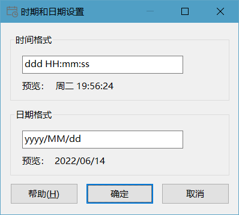
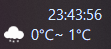
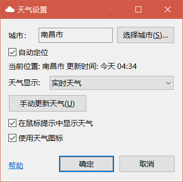
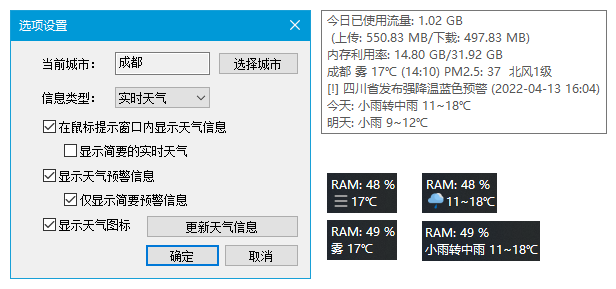
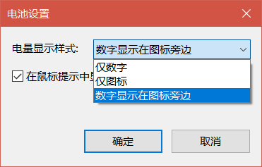
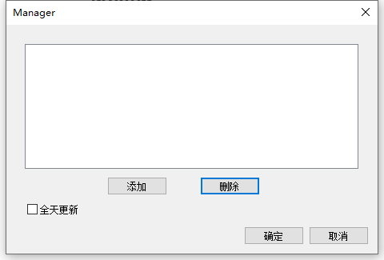
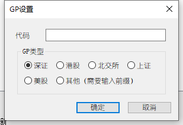
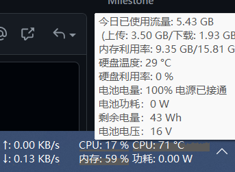
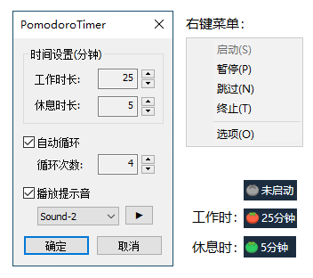
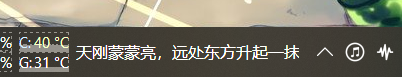

**[简体中文](plugin_download.md) | English**

# TrafficMonitor Plugin Download

It is welcome to develop your own plugin for TrafficMonitor. If you want to submit your plugin, please compile the plugin to dll file and email it to zhongyang219@hotmail.com. Please marked "TrafficMonitor Plugin" in the email. Please provide 32-bit and 64-bit versions whenever possible.

## How to develop the plugin

About how to develop the plugin for TrafficMonitor, please refer to [Plugin Development Guide](https://github.com/zhongyang219/TrafficMonitor/wiki/Plugin-Development-Guide).

## Plugin Usage Instructions

Please download the corresponding version (32 bit or 64 bit)  According to the version of TrafficMonitor you use. After downloaded, please put the dll file in the "plugins" directory where TrafficMonitor.exe is located (Create it if directory "plugins" is not exist). Then restart TrafficMonitor, the plugin will be loaded automatically. 

For the detail description of the plugin usage instruction, please refer to the following link:

[插件功能 · zhongyang219/TrafficMonitor Wiki (github.com)](https://github.com/zhongyang219/TrafficMonitor/wiki/插件功能)

## Plugin download

### Time date plugin

A plugin used to display the date and time.

Download url: [32 bit download](https://github.com/zhongyang219/TrafficMonitorPlugins/blob/main/download/DateTime/DateTime_V1.0_x86.zip?raw=true) [64 bit download](https://github.com/zhongyang219/TrafficMonitorPlugins/blob/main/download/DateTime/DateTime_V1.0_x64.zip?raw=true)

---

### Weather plugin

A plugin for displaying the weather. Support manual selection of cities (only cities in China is supported), support display of today's and tomorrow's weather.

Download url: [32 bit download](https://github.com/zhongyang219/TrafficMonitorPlugins/blob/main/download/weather/Weather_V1.02_x86.zip?raw=true) [64 bit download](https://github.com/zhongyang219/TrafficMonitorPlugins/blob/main/download/weather/Weather_V1.02_x64.zip?raw=true)

---

### Weather plugin 2

A plugin for displaying the weather. Support web fetching and weather API two data sources.

Author: [Haojia521](https://github.com/Haojia521)

Home page: [Haojia521/TrafficMonitorPlugins (github.com)](https://github.com/Haojia521/TrafficMonitorPlugins)

Download url: [WeatherPro-releases](https://github.com/Haojia521/TrafficMonitorPlugins/releases)

---

### Battery plugin

A plugin for displaying the battery level of your computer.

Download url: [32 bit download](https://github.com/zhongyang219/TrafficMonitorPlugins/blob/main/download/Battery/Battery_V1.02_x86.zip?raw=true) [64 bit download](https://github.com/zhongyang219/TrafficMonitorPlugins/blob/main/download/Battery/Battery_V1.02_x64.zip?raw=true)

---

### Stock plugin

Displays real-time trading information for specified stocks. Use the Sina interface.

- **sh indicates Shanghai Stock Exchange, sz indicates Shenzhen Stock Exchange, and so on.**

Author: [CListery](https://github.com/CListery)

Download url: [32 bit download](https://github.com/zhongyang219/TrafficMonitorPlugins/blob/main/download/GP/GP_V1.12_x86.zip?raw=true) [64 bit download](https://github.com/zhongyang219/TrafficMonitorPlugins/blob/main/download/GP/GP_V1.12_x64.zip?raw=true)

---

### Battery power detection plugin

A plugin for displaying the battery power consumption. At the same time, the remaining battery and battery voltage information can be displayed in the mouse tool tip.

Author: [AzulEterno](https://github.com/AzulEterno)

Home page: [AzulEterno/Plugins-For-TrafficMonitor (github.com)](https://github.com/AzulEterno/Plugins-For-TrafficMonitor)

Download url: [32 bit download](https://github.com/AzulEterno/Plugins-For-TrafficMonitor/raw/main/archs/x86/PowerMonPlugin.dll) [64 bit download](https://github.com/AzulEterno/Plugins-For-TrafficMonitor/raw/main/archs/x64/PowerMonPlugin.dll)

---

### Tomato clock plugin

A plugin Providing basic tomato time management functions. The red icon represents the working period and the green represents the rest period.

Author: [Haojia521](https://github.com/Haojia521)

Download url: [PomodoroTimer-releases](https://github.com/Haojia521/TrafficMonitorPlugins/releases)

---

### Text reader plugin

The text reader plugin can be used to read text files in the taskbar. Including chapter recognition, bookmarking, automatic page turning and other functions.

Use the mouse click or down arrow key to turn the page backward, the up arrow keys to turn the page forward. The left and right arrow keys to move the page one character at a time.

Download url: [32 bit download](https://github.com/zhongyang219/TrafficMonitorPlugins/blob/main/download/TextReader/TextReader_V1.01_x86.zip?raw=true) [64 bit download](https://github.com/zhongyang219/TrafficMonitorPlugins/blob/main/download/TextReader/TextReader_V1.01_x64.zip?raw=true)

---

