**[简体中文](plugin_download.md) | English**

# TrafficMonitor Plugin Download

It is welcome to develop your own plugin for TrafficMonitor. If you want to submit your plugin, please send email to zhongyang219@hotmail.com and attach the download URL. Please marked "TrafficMonitor Plugin" in the email.

## How to develop the plugin

About how to develop the plugin for TrafficMonitor, please refer to [Plugin Development Guide](https://github.com/zhongyang219/TrafficMonitor/wiki/Plugin-Development-Guide).

## Plugin Usage Instructions

Please download the corresponding version (32 bit or 64 bit)  According to the version of TrafficMonitor you use. After downloaded, please put the dll file in the "plugins" directory where TrafficMonitor.exe is located (Create it if directory "plugins" is not exist). Then restart TrafficMonitor, the plugin will be loaded automatically. 

For the detail description of the plugin usage instruction, please refer to the following link:

[插件功能 · zhongyang219/TrafficMonitor Wiki (github.com)](https://github.com/zhongyang219/TrafficMonitor/wiki/插件功能)

## Plugin download

### Time date plugin

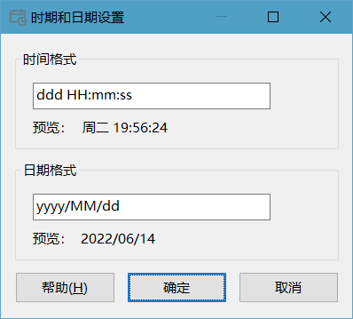

A plugin used to display the date and time.

* Version: V1.00

* Download url: 

  GitHub: [Release DateTime_V1.00 · zhongyang219/TrafficMonitorPlugins](https://github.com/zhongyang219/TrafficMonitorPlugins/releases/tag/DateTime_V1.00)

  Gitee: [DateTime_V1.00 · zhongyang219/TrafficMonitorPlugins - Gitee.com](https://gitee.com/zhongyang219/TrafficMonitorPlugins/releases/tag/DateTime_V1.00)

---

### Weather plugin

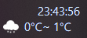

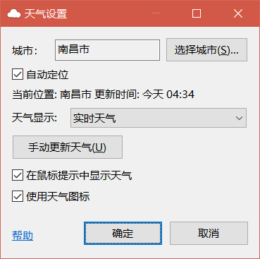

A plugin for displaying the weather. Support manual selection of cities (only cities in China is supported), support display of today's and tomorrow's weather.

* Version: V1.03

* Download url: 

  GitHub: [Release Weather_V1.03 · zhongyang219/TrafficMonitorPlugins](https://github.com/zhongyang219/TrafficMonitorPlugins/releases/tag/Weather_V1.03)

  Gitee: [Weather_V1.03 · zhongyang219/TrafficMonitorPlugins - Gitee.com](https://gitee.com/zhongyang219/TrafficMonitorPlugins/releases/tag/Weather_V1.03)

---

### WeatherPro

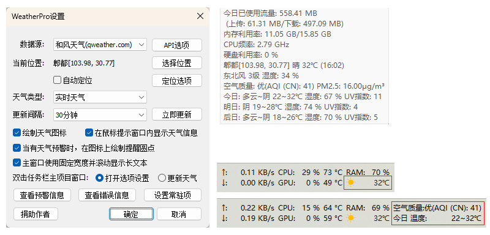

A plugin for displaying weather. Supports multiple data sources and rich configuration options.

* Author: [Haojia521](https://github.com/Haojia521)

* Download url: 

  Github: https://github.com/Haojia521/TMP-WeatherPro/releases
  
  Gitee: https://gitee.com/Haojia521/TMP-WeatherPro/releases

---

### Battery plugin

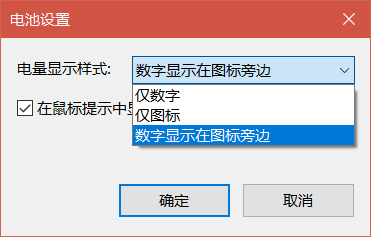

A plugin for displaying the battery level of your computer.

* Version: V1.03

* Download url:

  GitHub: [Release Battery_V1.03 · zhongyang219/TrafficMonitorPlugins](https://github.com/zhongyang219/TrafficMonitorPlugins/releases/tag/Battery_V1.03)

  Gitee: [Battery_V1.03 · zhongyang219/TrafficMonitorPlugins - Gitee.com](https://gitee.com/zhongyang219/TrafficMonitorPlugins/releases/tag/Battery_V1.03)

---

### Stock plugin

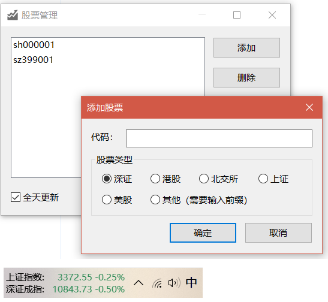

Displays real-time trading information for specified stocks. Use the Sina interface.

- **sh indicates Shanghai Stock Exchange, sz indicates Shenzhen Stock Exchange, and so on.**

* Author: [CListery](https://github.com/CListery)

* Download url:

  GitHub: [Release Stock_V1.13 · zhongyang219/TrafficMonitorPlugins](https://github.com/zhongyang219/TrafficMonitorPlugins/releases/tag/Stock_V1.13)

  Gitee: [Stock_V1.13 · zhongyang219/TrafficMonitorPlugins - Gitee.com](https://gitee.com/zhongyang219/TrafficMonitorPlugins/releases/tag/Stock_V1.13)

---

### Battery power detection plugin

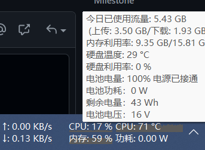

A plugin for displaying the battery power consumption. At the same time, the remaining battery and battery voltage information can be displayed in the mouse tool tip.

* Author: [AzulEterno](https://github.com/AzulEterno)

* Home page: [AzulEterno/Plugins-For-TrafficMonitor (github.com)](https://github.com/AzulEterno/Plugins-For-TrafficMonitor)

* Download url: [Releases · AzulEterno/PowerMonPlugin-For-TrafficMonitor](https://github.com/AzulEterno/PowerMonPlugin-For-TrafficMonitor/releases)

---

### Tomato clock plugin

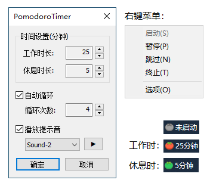

A plugin Providing basic tomato time management functions. The red icon represents the working period and the green represents the rest period.

* Author: [Haojia521](https://github.com/Haojia521)

* Download url: [PomodoroTimer-releases](https://github.com/Haojia521/TrafficMonitorPlugins/releases)

---

### Text reader plugin

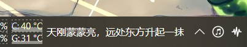

The text reader plugin can be used to read text files in the taskbar. Including chapter recognition, bookmarking, automatic page turning and other functions.

Use the mouse click or down arrow key to turn the page backward, the up arrow keys to turn the page forward. The left and right arrow keys to move the page one character at a time.

* Version: V1.02

* Download url:

  GitHub: [Release TextReader_V1.02 · zhongyang219/TrafficMonitorPlugins](https://github.com/zhongyang219/TrafficMonitorPlugins/releases/tag/TextReader_V1.02)

  Gitee: [TextReader_V1.02 · zhongyang219/TrafficMonitorPlugins - Gitee.com](https://gitee.com/zhongyang219/TrafficMonitorPlugins/releases/tag/TextReader_V1.02)

---

### Hardware Monitor plugin

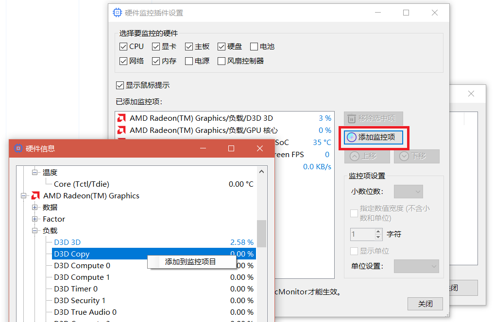

Description:

- Hardware monitor plugin used the third-party library LibreHardwareMonitor. It can be used in both the Standard and Lite versions of TrafficMonitor. But since the Lite version does not have administrator privileges, it may not be possible to display all the hardware information.
- Unzip the file, place `HardwareMonitor.dll` in the `plugins` directory, and place `LibreHardwareMonitorLib.dll` to TrafficMonitor directory (NOT `plugins` directory). Since the standard version of TrafficMonitor contains a `LibreHardwareMonitorLib.dll`, so this file can be ignored.
- Start TrafficMonitor, open "Plugin Manager" dialog, select "Hardware Monitor plugin", click "Options", click "Add monitoring Items" button, right click the item to be monitored, select "Add to monitoring items", and close the dialog.
- Close all dialogs, restart TrafficMonitor, right-click the taskbar window, select "Display Settings", the added hardware monitoring items can be seen in the dialog.

* Version: V1.00

* Download url:

  GitHub: [Release HardwareMonitor_V1.00 · zhongyang219/TrafficMonitorPlugins](https://github.com/zhongyang219/TrafficMonitorPlugins/releases/tag/HardwareMonitor_V1.00)

  Gitee: [HardwareMonitor_V1.00 · zhongyang219/TrafficMonitorPlugins - Gitee.com](https://gitee.com/zhongyang219/TrafficMonitorPlugins/releases/tag/HardwareMonitor_V1.00)

---

### IP address plugin

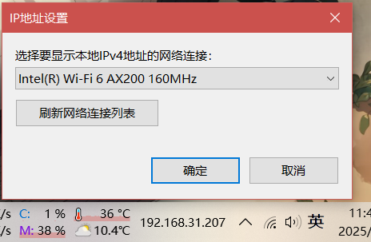

A plugin to display the local IP address.

* Version: V1.00

* Download url:

  GitHub: [Release IpAddress_V1.00 · zhongyang219/TrafficMonitorPlugins](https://github.com/zhongyang219/TrafficMonitorPlugins/releases/tag/IpAddress_V1.00)

  Gitee: [IpAddress_V1.00 · zhongyang219/TrafficMonitorPlugins - Gitee.com](https://gitee.com/zhongyang219/TrafficMonitorPlugins/releases/tag/IpAddress_V1.00)

---

### Lua Plugin

A TrafficMonitor plugin to support writing plugin by lua script.

* Author: [compilelife](https://github.com/compilelife)

* Homepage: [compilelife/TrafficMonitorLuaPlugin: Missing Plugin for TrafficMonitor to support lua](https://github.com/compilelife/TrafficMonitorLuaPlugin)

* Download url: [Releases · compilelife/TrafficMonitorLuaPlugin](https://github.com/compilelife/TrafficMonitorLuaPlugin/releases)

### Keyboard Indicator

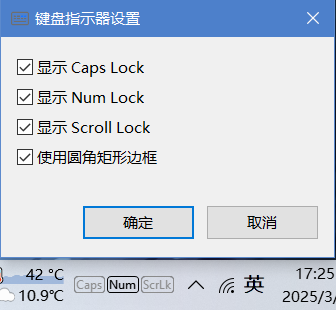

A plugin used to display the status of keys such as Caps Lock, Num Lock, and Scroll Lock on the keyboard.

* Version: V1.00

* Download url:

  GitHub: [Release KeyboardIndicator_V1.00 · zhongyang219/TrafficMonitorPlugins](https://github.com/zhongyang219/TrafficMonitorPlugins/releases/tag/KeyboardIndicator_V1.00)

  Gitee: [KeyboardIndicator_V1.00 · zhongyang219/TrafficMonitorPlugins - Gitee.com](https://gitee.com/zhongyang219/TrafficMonitorPlugins/releases/tag/KeyboardIndicator_V1.00)

### Loudness Meter

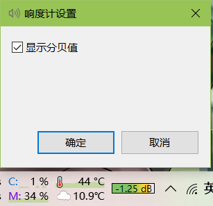

A plugin used to display the current system volume.

* Version: V1.00

* Download url:

  GitHub: [Release LoudnessMeter_V1.00 · zhongyang219/TrafficMonitorPlugins](https://github.com/zhongyang219/TrafficMonitorPlugins/releases/tag/LoudnessMeter_V1.00)

  Gitee: [LoudnessMeter_V1.00 · zhongyang219/TrafficMonitorPlugins - Gitee.com](https://gitee.com/zhongyang219/TrafficMonitorPlugins/releases/tag/LoudnessMeter_V1.00)

### MijiaPluginForTM

这是一个 TrafficMonitor 插件，可以在 Windows 任务栏实时显示米家/酷控（cuco）智能插座的功率数值，并可选开启功率历史记录功能。

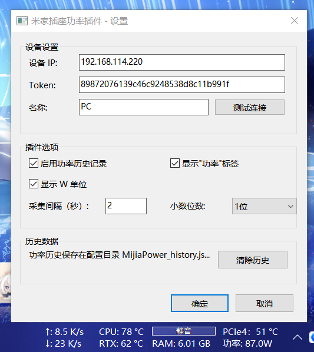

* Author: [cxhoyo](https://github.com/cxhoyo)
* Homepage: [cxhoyo/MijiaPluginForTM: 米家智能插座功率显示插件_TrafficMonitor](https://github.com/cxhoyo/MijiaPluginForTM/tree/main?tab=readme-ov-file)
* Download url: [Releases · cxhoyo/MijiaPluginForTM](https://github.com/cxhoyo/MijiaPluginForTM/releases)

# IP Location Plugin

I’ve built a brand-new IPLocation plugin for TrafficMonitor! It accurately displays your public egress IP and its geographic location with auto-refresh every 30s, perfectly fixing the original plugin’s flaws of inaccurate IP display and no location support.
Super practical for these scenarios:✅ VPN/Proxy users: Instantly verify node switching results & confirm egress IP/region✅ Remote work/development: Quick check of public IP for server connection/port mapping✅ Network troubleshooting: Fast confirm real egress IP to locate network issues✅ Multi-node testing: Effortlessly check IP status when switching different proxy/VPN nodes
It’s lightweight and works seamlessly with TrafficMonitor v1.85.1 (Win10/11 x64).

* Author: [byLennert](https://github.com/byLennert)
* Homepage: [byLennert/IPLocation_for_TrafficMonitor: a tool for TrafficMonitor to show current ip and region.](https://github.com/byLennert/IPLocation_for_TrafficMonitor)
* Download url: [Releases · byLennert/IPLocation_for_TrafficMonitor](https://github.com/byLennert/IPLocation_for_TrafficMonitor/releases)

### Ping Plugin

A plugin for [TrafficMonitor](https://github.com/zhongyang219/TrafficMonitor) that displays **real-time ping latency** to a configurable host directly in your Windows taskbar.

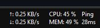

* Author: [wwwroot](https://github.com/wwwroot)
* Homepage: [wwwroot/TrafficMonitorPingPlugin: A TrafficMonitor plugin to display ping latency to configurable hosts (e.g. google.com)](https://github.com/wwwroot/TrafficMonitorPingPlugin)
* Download url: [Releases · wwwroot/TrafficMonitorPingPlugin](
